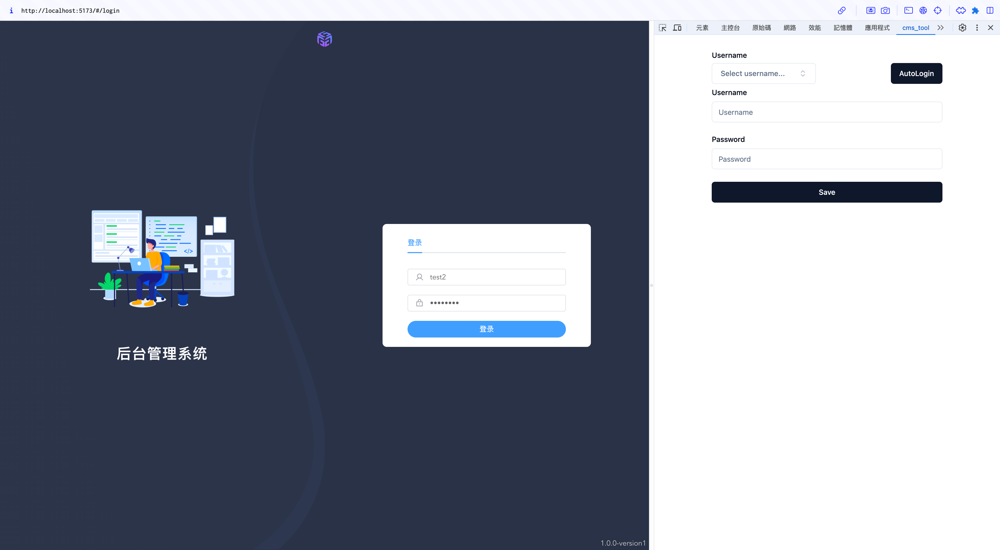

# Front_Chrome_Extension



## Requirements

The `svelte-devtools` extension requires the following:

	- Vue3
	- Menifest3

## Development

Clone this repository and setup the environment with `npm`

```
http://git.ggyyonline.com:8080/frontend/front_chrome_extension.git
cd front_chrome_extension
npm install
```

To hardreload run

```
npm run dev
```

To build the extension

```
npm run build
```

This will build the extension and create a directory called `dist`. Steps may vary depending on the browser you are using, but generally:

1. Navigate to the extensions settings page
2. Turn on the 'Developer mode' switch
3. Click 'Load Unpacked' and select the `dist` directory
